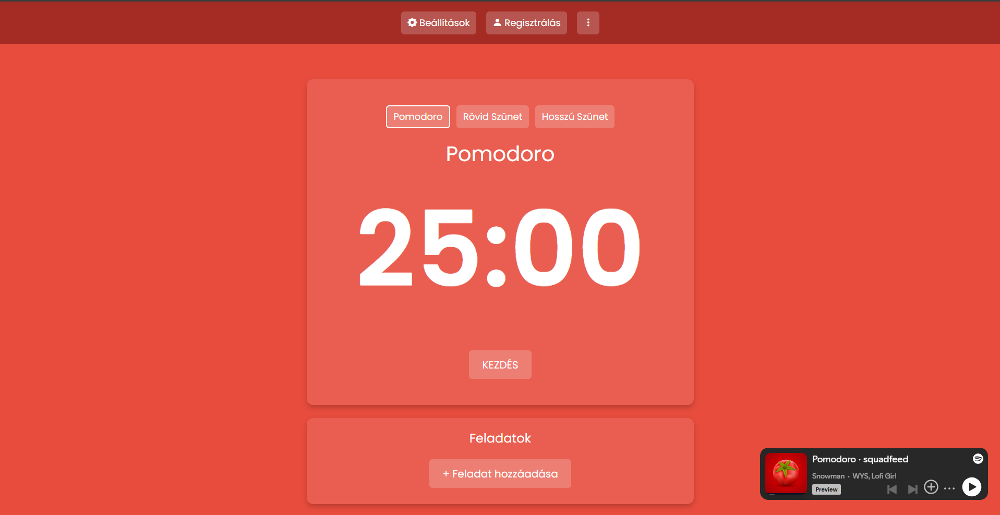

# Pomodoro Project

A Pomodoro egy időgazdálkodási technika, amelyet Francesco Cirillo fejlesztett ki az 1980-as évek végén. A módszer célja a fókuszált munkavégzés és a produktivitás növelése rövid, intenzív munkaidőszakok és rövid szünetek váltakoztatásával.
- ### [Követelmény specifikáció](https://github.com/nacsacsa/Pomodoro/blob/main/K%C3%B6vetelm%C3%A9ny%20specifik%C3%A1ci%C3%B3.md)
- ### [Funkcionális specifikáció](https://github.com/nacsacsa/Pomodoro/blob/main/Funkcion%C3%A1lis%20specifik%C3%A1ci%C3%B3.md)
- ### [Rendszerterv](https://github.com/nacsacsa/Pomodoro/blob/main/Rendszerterv.md)

## Demo oldal:
- https://nacsacsa.github.io/Pomodoro/