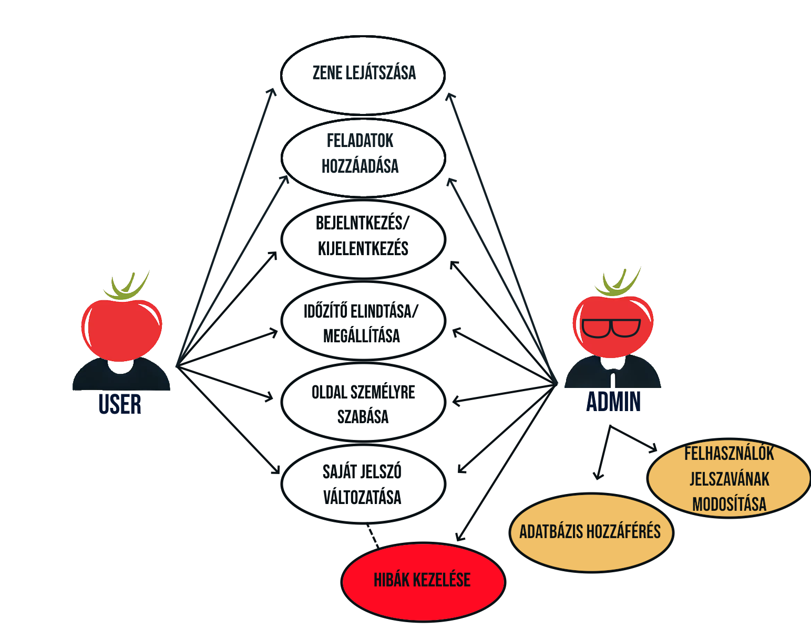
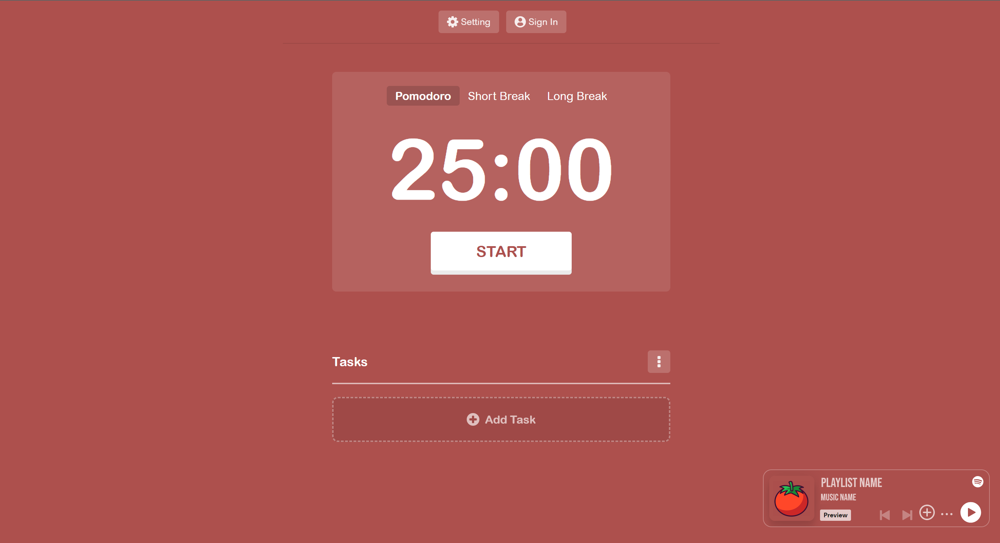
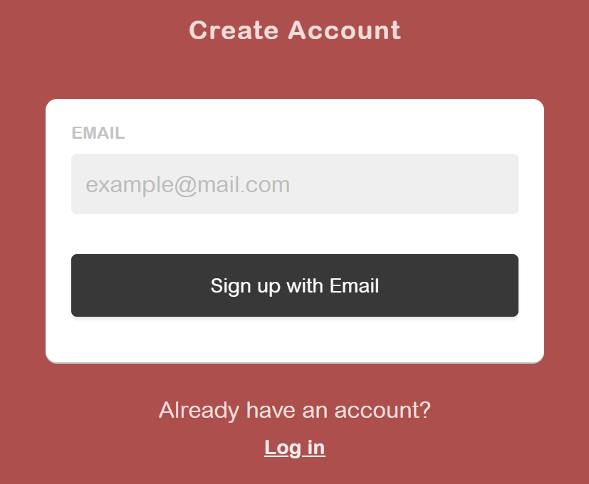
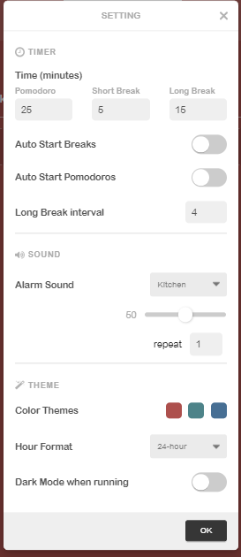
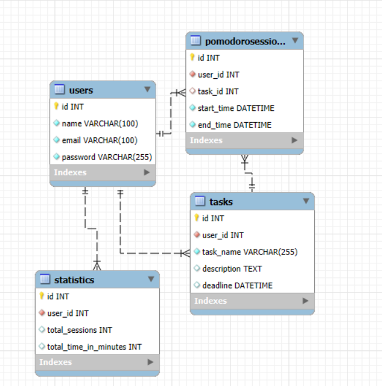

# Rendszerterv – Pomodoro Webalkalmazás

## 1. A rendszer célja    

A **TimeFlow Solutions** megbízásából egy Pomodoro technikán alapuló webalkalmazás fejlesztése a cél, amely hatékony időgazdálkodási eszközt nyújt felhasználók számára. A Pomodoro technika lényege, hogy rövid, 25 perces időblokkokban dolgozik a felhasználó, amit egy rövid szünet követ, majd minden negyedik blokk után hosszabb pihenőt vehet. Az alkalmazás segíti a munkafolyamatok tervezését, a hatékonyság növelését, valamint a feladatok nyomon követését. A rendszer alapvető célja egy olyan könnyen használható és hozzáférhető platform létrehozása, amely mobil és asztali eszközökön is elérhető, és integrálható más produktivitást támogató alkalmazásokkal, mint például Google Calendar vagy Trello. Az alkalmazás személyre szabható Pomodoro időzítőket kínál, statisztikai áttekintést biztosít a felhasználói teljesítményről, és motiváló visszajelzéseket nyújt a produktív időszakok sikeres lezárásakor.  

## 2. Projektterv  

A projekt három hónapra van tervezve, négy fő fázisra bontva: **tervezés**, **fejlesztés**, **tesztelés** és **átadás**. A projektben négy fejlesztői szerepkör vesz részt: frontend fejlesztő, backend fejlesztő, UX/UI designer és tesztelő. A tervezés fázisa két hétig tart, amely során a rendszerterv, az adatbázis és a funkcionális specifikációk kerülnek kidolgozásra. A fejlesztés szakasza négy hétig tart, amely alatt a frontend és backend modulok integrálása, valamint az adatbázis létrehozása történik. A tesztelési fázisban két hét alatt az alkalmazás hibajavítása, optimalizálása és felhasználói tesztelése valósul meg. A projekt végső két hetében az átadás és dokumentáció kerül sorra, valamint a kliens számára történő átadási fázis. A fejlesztés agilis módszertan szerint halad, ahol két hetes sprintek biztosítják a folyamatos visszacsatolást és iteratív fejlesztést.

### **Projektmunkások és felelőségek:**
#### **Backend munkálatok:** Kolozsi Márton
Feldata A háttérfolyamatokat létrehozni
#### **Frontend munkálatok:** Délczeg Sándor Balázs
Feladata a frontend kialakítása
#### **Full stack:** Horog Gabriella, Horog Regina
Feladatuk a háttérfolyamatok összekötése a kinézettel, adatbázis összekötése a frontendel

### **Ütemterv:**
| Funckió                   | Feladat                       | Prioritás |
|---------------------------|-------------------------------|-----------|
| Követelmény specifikáció  |                               | 0         |
| Funkcionális specifikáció |                               | 0         |
| Rendszerterv              |                               | 0         |
| Model                     | Python script megírása        | 2         |
| Model                     | Segéd osztályok megírása      | 2         |
| Felhasználói felület      | Kezdő képernyő kialakítása    | 2         |
| Felhasználói felület      | Fő képernyő kialakítása       | 2         |
| Adatbázis                 | Admin felhasználó elkészítése | 3         |
| Felhasználói felület      | Reszponzivitás                | 3         |

## 3. Üzleti folyamatok modellje

Az alkalmazás fő célcsoportja az időgazdálkodást és hatékonyságot javítani kívánó egyének és kisvállalkozások, akik a Pomodoro technika révén növelhetik termelékenységüket. A rendszer működési folyamata azzal kezdődik, hogy a felhasználó létrehozza fiókját, majd megadhatja a napi feladatait. A felhasználó egy Pomodoro időszakot indíthat, melynek végén az alkalmazás automatikusan elindítja a szünetet. Minden felhasználó hozzáférhet személyes statisztikákhoz, amelyek megmutatják, mennyi időt töltöttek produktív munkával, illetve pihenéssel. A rendszer lehetővé teszi a feladatok fontossági sorrendbe állítását és azok időzítését a nap különböző időpontjaira. Az adminisztrációs panelen keresztül a rendszergazdák ellenőrizhetik a felhasználói aktivitást és kezelhetik a bejelentett hibákat. Az üzleti folyamatok fontos eleme az is, hogy a felhasználó hozzáadhatja saját jegyzeteit, céljait, és ezeket a rendszer elemzi, visszajelzést adva a haladásról.

## 4. Követelmények

A Pomodoro alkalmazásnak több fontos követelményt kell teljesítenie.

**Funkcionális követelmények**:
- A felhasználóknak lehetőségük kell, hogy legyen egyéni Pomodoro időszakok indítására és befejezésére.
- A rendszernek támogatnia kell a feladatok kezelését, ideértve az új feladatok létrehozását, szerkesztését, törlését és fontossági sorrendbe állítását.
- A felhasználók hozzáférést kapnak statisztikákhoz, amelyek tartalmazzák az elvégzett Pomodoro munkamenetek számát, a szünetek idejét és a produktív időszakokat.
- A rendszernek e-mailes értesítéseket és emlékeztetőket kell küldenie a felhasználóknak.

**Nem funkcionális követelmények**:
- Az alkalmazás legyen gyors, és minden felhasználói kérésre maximum 2 másodperc alatt válaszoljon.
- A rendszernek platformfüggetlennek kell lennie, tehát böngészőből, mobilról és tabletről is használhatónak kell lennie.
- A rendszer biztonságosan tárolja a felhasználói adatokat titkosított adatbázisban, és GDPR kompatibilis legyen.

## 5. Funkcionális terv

A Pomodoro alkalmazás fő funkciói között szerepel az időzítők kezelése, feladatok nyomon követése és statisztikák megjelenítése. A felhasználók a főoldalon Pomodoro időzítőt indíthatnak, ahol a standard 25 perces munkamenetet és 5 perces szünetet alapértelmezésként kínálja a rendszer, de lehetőséget biztosít egyéni időzítők beállítására is. A feladatkezelés modul lehetővé teszi, hogy a felhasználók új feladatokat adjanak hozzá, felosztva azokat több Pomodoro ciklusra. Az alkalmazás a felhasználói fiókokhoz kapcsolódó adatokat felhasználói profilon belül tárolja, ahol a statisztikai adatok megtekinthetők, például az egyes napokon végrehajtott Pomodoro szám, a szünetek időtartama és a teljesített feladatok listája. Az alkalmazás push értesítésekkel és e-mail értesítésekkel is támogatja a felhasználót, hogy mindig tudatában legyen a következő munkamenetnek vagy szünetnek.

## 6. Fizikai környezet

A Pomodoro webalkalmazás egy felhőalapú infrastruktúrán fog futni az AWS szolgáltatásainak használatával, amely biztosítja a skálázhatóságot és a megbízhatóságot. A rendszer egy klasszikus 3-tier architektúrában működik: frontend, backend és adatbázis rétegekre bontva.
- A frontend részt HTML5, CSS3 és JavaScript (React keretrendszer) segítségével fejlesztjük, amelyet az AWS CloudFront segítségével szolgáltatunk.
- A backend Java nyelven, Spring Boot keretrendszerrel készül, és az AWS Lambda futtatja, amely biztosítja a skálázható kiszolgálást.
- Az adatbázist egy AWS RDS MySQL szolgáltatás biztosítja, amely automatikusan menti és kezeli a felhasználói adatokat.
  - A fejlesztői környezetben Docker konténereket használunk a lokális fejlesztési és tesztelési feladatok egyszerűbb kezelése érdekében.
  - A rendszer folyamatos integrációját és szállítását (CI/CD) az AWS CodePipeline támogatja.

## 7. Architekturális terv  

Az alkalmazás n-tier architektúrában működik, külön választva a felhasználói interfészt (frontend), az üzleti logikát (backend) és az adatkezelést (adatbázis). A frontend része egy React-alapú webalkalmazás, amely az AWS S3 és CloudFront segítségével kerül tárolásra és kiszolgálásra. Az üzleti logika egy RESTful API-n keresztül kommunikál a frontenddel, amelyet Java és Spring Boot keretrendszerrel fejlesztünk, és az AWS Lambda szolgáltatásai futtatnak. Ez az architektúra lehetővé teszi a skálázható, kiszolgálómentes működést, amely nagy terhelés alatt is képes optimális teljesítményt nyújtani. Az API összekapcsolódik egy MySQL-alapú adatbázissal, amelyet az AWS RDS szolgáltatás kezel, biztosítva
a gyors adattárolást és lekérdezést. A rendszer alapvető része a felhasználói hitelesítés és jogosultságkezelés, amelyet JWT (JSON Web Token) technológiával valósítunk meg.

## 8. Adatbázis modell   

Az adatbázis a rendszer kulcsfontosságú eleme, amely a felhasználói fiókokat, Pomodoro munkameneteket, feladatokat és statisztikákat tárolja. Az adatbázis relációs modellként épül fel MySQL alapokon, ahol a fő entitások a következők:  
- **Users**: A felhasználói adatokat (név, e-mail, jelszó) tárolja.  
- **Tasks**: A feladatokat tárolja, kapcsolódik a felhasználókhoz, és tartalmazza a feladat nevét, leírását, határidejét.  
- **Pomodoro Sessions**: A felhasználók által végrehajtott Pomodoro időszakokat rögzíti, tárolva a kezdési és befejezési időt, valamint a kapcsolódó feladatot.  
- **Statistics**: A felhasználói aktivitást gyűjti össze, például a végrehajtott Pomodoro munkamenetek számát, az összesített időt, és az eredményeket.

Az entitások közötti kapcsolatok segítségével a rendszer képes gyors lekérdezéseket végezni a felhasználói statisztikák és feladatok állapotának megjelenítéséhez.